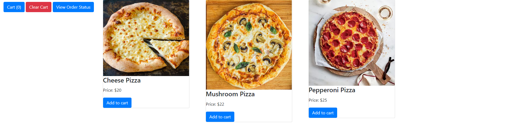
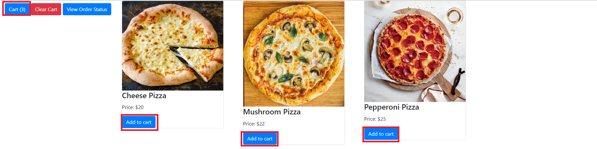
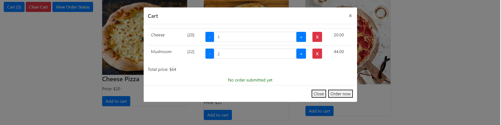
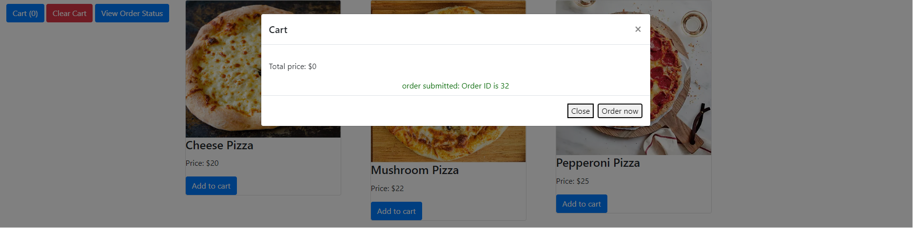
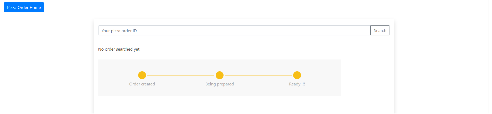
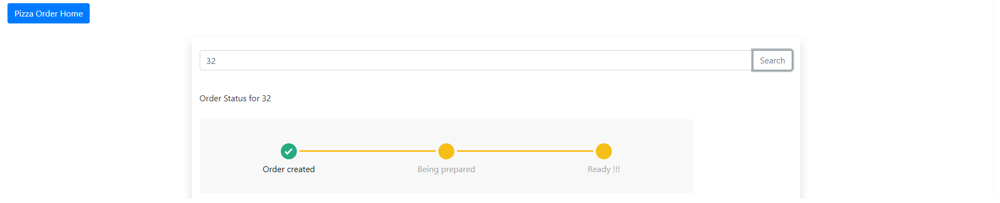

# Pizza Order App Demo

This demo is a containerized microservice application consisting of a Node.js web app taking Pizza orders from customers, and an .NET 6 backend for dispatching the order to be made and for getting order status upon customer inqueries. The instruction is for testing locally and deploying to Azure Container Apps platform. This tutorial was created on Windows 11. The command line deployment scripts may vary on different platforms.
* [Demo Walkthrough](#demo-walkthrough)
* [Pre-requisites](#pre-requisites)
* [Test locally](#test-locally)
* [Deploy to Azure](#deploy-to-azure)

## Demo Walkthrough
The Pizza Order App demo has the following features:
* Browse pizza options on homepage 
* Add pizzas to cart on homepage
* Edit shopping cart
* Submit order
* Check oder status by order ID

**1. Browse pizza options and add to cart on the homepage**


**2. Add pizzas to cart on homepage**


**3. Edit shopping cart**


**4. Submit Order**


**5. Check oder status by order ID**



## Pre requisites
* Install [Docker](https://docs.docker.com/engine/install/)
* Install [Dapr CLI](https://docs.dapr.io/getting-started/install-dapr-cli/)
* Install [Azure CLI](https://learn.microsoft.com/cli/azure/install-azure-cli)
* Install [Node.js](https://nodejs.org/download/)
* Install [.NET 6](https://dotnet.microsoft.com/download/dotnet/6.0)
* Have a working Azure subscription
* Create a service bus with *Standard* sku or above. Create a *Topic* called *order*
* Create a Cosomos DB with SQL interface. Create a new *Database* called *pizza-demo-db* and a *container* under the database called *pizza-demo-container*. Put */id* as partition key in the container.

## Test Locally
Download this repository to test the code locally.
### Edit Dapr component files
In */components* directory there are two Dapr component files:
* pubsub.yaml
* statestore.yaml

Put your Azure service bus connection string in pubsub.yaml and Azure CosmosDB master key in statestore.yaml.

### Run PizzaWeb
Change project to the *PizzaWeb* directory. Initialize the project:
```
npm install
```
Run the service with Dapr side car process:

Run the following command under the dir *pizza-microservice-containers/PizzaWeb*
```
dapr run --dapr-http-port 3500 --app-id order-web --components-path ../components/ --app-port 3001 -- npm run debug
```

Web application's entry point is : http://localhost:3000/ 

## PizzaOrderProcessor
Change project to the *PizzaOrderProcessor* directory.
Initialize the project:
```
dotnet restore
dotnet build
```
Run the service with Dapr side car process:
```
dapr run --dapr-http-port 3600 --app-id order-processor-http --components-path ../components_local/ --app-port 3001 -- dotnet run --project .
```
The Pizza Demo App should be running locally now. Test by creating orders and checking for order status. 

## Deploy To Azure
In */aca-dapr-components* directory there are two Dapr component files:
* pubsub.yaml
* statestore.yaml

Put your Azure Service Bus connection string in pubsub.yaml and Azure CosmosDB master key in statestore.yaml.

### Login to Azure using Azure CLI

1. Login using your Azure account
```azure cli
az login
```
2. Select a subscription if your account is associated with multiple subscriptions
```azure cli
az account set --s "your subscription ID"
```

3. Add Azure Container App CLI extenion
```
az extension add --name containerapp --upgrade
```

4. Register Container App namespace in your subscription
```
az provider register --namespace Microsoft.App
```

5. Register Log Analytics workspace in your subscription
```
az provider register --namespace Microsoft.OperationalInsights
```

### Create Azure Container App Environment in Azure
1. Create environment variables in Command Prompt:
```azure cli
set RESOURCE_GROUP="your resource group name"
set LOCATION="westus"
set CONTAINERAPPS_ENVIRONMENT="your container app environment name"
```

2. Create resource group
```azure cli
az group create --name %RESOURCE_GROUP% --location %LOCATION%
```

3. Create Azure Container App Environment
```azure cli
az containerapp env dapr-component set --name %CONTAINERAPPS_ENVIRONMENT% --resource-group %RESOURCE_GROUP% --dapr-component-name pubsub --yaml pubsub.yaml
```

### Deploy Dapr component
Change directory to */aca-dapr-components*

1. Deploy session state store
```
az containerapp env dapr-component set --name %CONTAINERAPPS_ENVIRONMENT% --resource-group %RESOURCE_GROUP% --dapr-component-name statestore --yaml statestore.yaml
```

2. Deploy pubsub 
```
az containerapp env dapr-component set --name %CONTAINERAPPS_ENVIRONMENT% --resource-group %RESOURCE_GROUP% --dapr-component-name pubsub --yaml pubsub.yaml
```

### Deploy Node.js webapp
Assuming container images has been built using the dockerfile in PizzaWeb and pushed to Dockerhub.

```
az containerapp create --name order-web --resource-group %RESOURCE_GROUP% --environment %CONTAINERAPPS_ENVIRONMENT%  --image <your docker hub account>/node-pizza-web:latest --target-port 3000 --ingress external --min-replicas 1 --max-replicas 1 --enable-dapr --dapr-app-id order-web --dapr-app-port 3000
```

### Deploy order dispatcher backend
Assuming container images has been built using the dockerfile in PizzaWeb and pushed to Dockerhub.

```
az containerapp create --name order-processor-http --resource-group %RESOURCE_GROUP% --environment %CONTAINERAPPS_ENVIRONMENT% --image <your docker hub account>/dotnet-pizza-backend:latest --target-port 3001 --ingress external --min-replicas 1 --max-replicas 1 --enable-dapr --dapr-app-id order-processor-http --dapr-app-port 3001
```